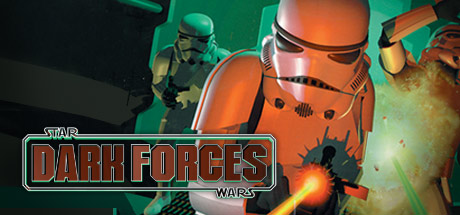

# Star Wars: Dark Forces

This is a reimplementation or remake of the 1996 classic Star Wars: Dark Forces. It is a **work in progres** so there are a lot of
things to do.

## Reimplementation

To reimplement Dark Forces I've been doing some reverse engineering of DARK.EXE and doing a lot of speculation on how the engine
works.

## File formats

Star Wars: Dark Forces uses a series of custom file formats, some of these files are really easy to parse, mainly because they're text-based file formats but others, like sprites, bitmaps, sounds, etc. are more challenging because they're binary and they're not known formats like .PCX or .BMP.

Next there is a list of known formats and their purpose:

| Extension | Purpose |
|:----------|:--------------
| .GOB      | Contains all the game files in a packed way
| .CMP      | Contains a color map
| .PAL      | Contains a palette
| .FNT      | Contains a font
| .BM       | Contains a screen bitmap
| .FME      | Contains a sprite
| .WAX      | Contains an animated multi-directional sprite
| .GMD      | Contains a MIDI song (it's a MIDI format 2 based file)
| .VOC      | Contains a sound (it's a Creative Voice Sound file)
| .LVL      | Contains a list of levels
| .LEV      | Contains a textual description of the geometry of a level
| .LFD      | Contains a LucasFilm DataFile? It usually contains backgrounds and movies
| .O        | Contains a textual description of the objects of a level
| .INF      | Contains a level script
| .CFG      | Contains settings or saved state (DARKPILO.CFG, JEDI.CFG)

## Weapons

- [ ] Fists
- [ ] Bryar Pistol
- [ ] Stormtrooper Blaster Rifle
- [ ] Thermal Detonator
- [ ] Imperial Repeater Gun
- [ ] Jeron Fusion Cutter
- [ ] I.M. Mines
- [ ] Packered Mortar Gun
- [ ] Stouker Concussion Rifle
- [ ] Assault Cannon

## Enemies

- [ ] Stormtrooper
- [ ] Commando
- [ ] Officer
- [ ] Dianoga
- [ ] Interrogation droid
- [ ] Probe droid
- [ ] Remote droid
- [ ] Mouse bot
- [ ] Reeyees
- [ ] Bossks
- [ ] Gamorrean
- [ ] Ceiling Turret
- [ ] Kell Dragon
- [ ] Boba Fett
- [ ] Phase One Dark Trooper
- [ ] Phase Two Dark Trooper
- [ ] Phase Three Dark Trooper

## Special Items

- [ ] Headlamp
- [ ] Night Vision Goggles
- [ ] Crampons
- [ ] Gasmask

## Thanks

- [Nicholas Jankowski](https://github.com/njankowski) for his great [Dark Forces Tools](https://github.com/njankowski/dftools)
- [LuciusDXL](https://github.com/luciusdxl) for his awesome [TheForceEngine](https://github.com/luciusdxl/theforceengine)
- [Mindwerks](https://github.com/Mindwerks) for its [XLEngine](https://github.com/Mindwerks/XLEngine)

Made with :heart: by [AzazelN28](https://github.com/azazeln28)
